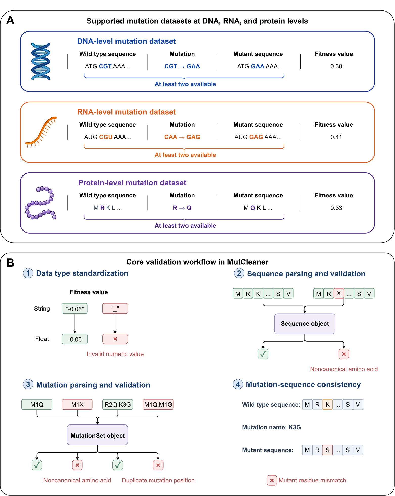

# MutCleaner

[](https://pypi.org/project/mutcleaner/)
[](https://pypi.org/project/mutcleaner/)
[](https://github.com/xulab-research/MutCleaner/blob/main/LICENSE)
[](https://huggingface.co/datasets/xulab-research/MutCleaner)
[](https://doi.org/10.64898/2026.09.06.749687)

## Overview

MutCleaner is an extensible Python framework that cleans, validates, and standardizes protein- and codon-level mutation datasets. The package combines dataset-specific cleaning pipelines with reusable sequence and mutation utilities, enabling reproducible preprocessing of large-scale mutational datasets for downstream bioinformatics and machine learning analyses.

* **Preprint**: https://doi.org/10.64898/2026.09.06.749687
* **Documentation**: https://xulab-research.github.io/MutCleaner
* **Cleaning Examples**: https://xulab-research.github.io/MutCleaner/user_guide/supported_datasets.html

<p align="center">
  
</p>


## Installation

```bash
pip install mutcleaner
```

## Repository structure

The overview below shows directories up to two levels deep and files at the repository root.

```text
MutCleaner/
├── .github/                  # GitHub configuration
│   └── workflows/            # Testing, documentation, and release workflows
├── doc/                      # Documentation and build configuration
│   ├── changelog/            # Version changelogs
│   └── source/               # Documentation source files
├── mutcleaner/               # MutCleaner Python package
│   ├── cleaners/             # Reusable cleaners and dataset-specific pipelines
│   ├── core/                 # Core data structures and processing framework
│   └── utils/                # Data conversion, parallel processing, and I/O utilities
├── plot/                     # Figure-generation scripts
│   └── figures/              # Figures and graphical assets
├── tests/                    # Tests for datasets, mutations, pipelines, and sequences
├── tools/                    # Changelog generation and release scripts
├── .gitignore                # Git ignore rules
├── CONTRIBUTING.md           # Contribution guidelines
├── LICENSE                   # Apache License 2.0
├── pyproject.toml            # Package metadata, dependencies, and build configuration
└── README.md                 # Project overview and usage instructions
```

## Key Capabilities

- **Mutation validation and standardization**: Parse amino-acid and codon substitutions, normalize mutation separators and position indexing, and detect invalid symbols, repeated mutation positions, out-of-range positions, and mismatches with reference sequences.

- **Sequence and mutation conversion**: Generate mutant sequences from reference sequences and mutation annotations, infer substitutions from equal-length sequence pairs, and convert codon mutations into amino-acid changes. DNA and RNA sequence utilities also support transcription, reverse transcription, translation, and reverse-complement operations.

- **Tabular data cleaning**: Map source columns to consistent names, convert data types, filter records with missing values or unwanted patterns, and resolve repeated measurements using mean aggregation, representative-row selection, or custom rules.

- **Configurable cleaning pipelines**: Use built-in pipelines for supported protein- and codon-level datasets, customize their settings, or assemble new workflows from reusable cleaning functions and dataset-specific transformations.

- **Inspection of cleaning results**: Retain failed records from validation and sequence-processing steps with error messages, inspect intermediate results, and access execution summaries with step status and runtime.

- **Parallel processing**: Run mutation validation, mutant-sequence generation, and sequence-based mutation inference across multiple worker processes, with configurable worker counts.

- **Unified dataset representation and export**: Organize reference sequences, mutation sets, labels, and metadata in a `MutationDataset`. Export each reference sequence and its variants as `wt.fasta`, `data.csv`, and `metadata.json` for downstream analysis.

## Quick Start

See the [Data Cleaners Usage Guide](https://xulab-research.github.io/MutCleaner/user_guide) for more examples.

## Supported Datasets

<table>
  <thead>
    <tr>
      <th>Dataset Name</th>
      <th>Reference</th>
      <th>Hugging Face Datasets URL</th>
    </tr>
  </thead>
  <tbody>
    <tr>
      <td>Human Domainome Dataset</td>
      <td><a href="https://doi.org/10.1038/s41586-024-08370-4">Site-saturation mutagenesis of 500 human protein domains</a></td>
      <td><a href="https://huggingface.co/datasets/xulab-research/MutCleaner/blob/main/Human_Domainome_Dataset/SupplementaryTable2.txt">SupplementaryTable2.txt</a><br><a href="https://huggingface.co/datasets/xulab-research/MutCleaner/blob/main/Human_Domainome_Dataset/SupplementaryTable4.txt">SupplementaryTable4.txt</a><br><a href="https://huggingface.co/datasets/xulab-research/MutCleaner/blob/main/Human_Domainome_Dataset/wild_type.fasta">wild_type.fasta</a></td>
    </tr>
    <tr>
      <td>ProteinGym DMS Substitutions Dataset</td>
      <td><a href="https://doi.org/10.1101/2023.12.07.570727">ProteinGym: Large-Scale Benchmarks for Protein Design and Fitness Prediction</a></td>
      <td><a href="https://huggingface.co/datasets/xulab-research/MutCleaner/blob/main/ProteinGym_DMS_Substitutions_Dataset/DMS_ProteinGym_substitutions.zip">DMS_ProteinGym_substitutions.zip</a></td>
    </tr>
    <tr>
      <td>Protein cDNA Proteolysis Dataset</td>
      <td><a href="https://doi.org/10.1038/s41586-023-06328-6">Mega-scale experimental analysis of protein folding stability in biology and design</a></td>
      <td><a href="https://huggingface.co/datasets/xulab-research/MutCleaner/blob/main/cDNA_Proteolysis_Dataset/Tsuboyama2023_Dataset2_Dataset3_20230416.csv">Tsuboyama2023_Dataset2_Dataset3_20230416.csv</a></td>
    </tr>
    <tr>
      <td>ddG Dataset</td>
      <td><a href="https://doi.org/10.1038/s43588-024-00716-2">Improving the prediction of protein stability changes upon mutations by geometric learning and a pre-training strategy</a></td>
      <td><a href="https://huggingface.co/datasets/xulab-research/MutCleaner/resolve/main/ddG_Dataset/M1261.csv">M1261.csv</a><br><a href="https://huggingface.co/datasets/xulab-research/MutCleaner/blob/main/ddG_Dataset/S461.csv">S461.csv</a><br><a href="https://huggingface.co/datasets/xulab-research/MutCleaner/blob/main/ddG_Dataset/S669.csv">S669.csv</a><br><a href="https://huggingface.co/datasets/xulab-research/MutCleaner/blob/main/ddG_Dataset/S783.csv">S783.csv</a><br><a href="https://huggingface.co/datasets/xulab-research/MutCleaner/blob/main/ddG_Dataset/S8754.csv">S8754.csv</a></td>
    </tr>
    <tr>
      <td>dTm Dataset</td>
      <td><a href="https://doi.org/10.1038/s43588-024-00716-2">Improving the prediction of protein stability changes upon mutations by geometric learning and a pre-training strategy</a></td>
      <td><a href="https://huggingface.co/datasets/xulab-research/MutCleaner/blob/main/dTm_Dataset/S4346.csv">S4346.csv</a><br><a href="https://huggingface.co/datasets/xulab-research/MutCleaner/blob/main/dTm_Dataset/S557.csv">S557.csv</a></td>
    </tr>
    <tr>
      <td>ArchStabMS1E10 Epistasis Dataset</td>
      <td><a href="https://doi.org/10.1038/s41586-024-07966-0">The genetic architecture of protein stability</a></td>
      <td><a href="https://huggingface.co/datasets/xulab-research/MutCleaner/blob/main/ArchStabMS1E10_Epistasis_Dataset/ArchStabMS1E10_Epistasis_Sup4_Dataset.csv">ArchStabMS1E10_Epistasis_Sup4_Dataset.csv</a><br><a href="https://huggingface.co/datasets/xulab-research/MutCleaner/blob/main/ArchStabMS1E10_Epistasis_Dataset/ArchStabMS1E10_Epistasis_Sup5_Dataset.csv">ArchStabMS1E10_Epistasis_Sup5_Dataset.csv</a></td>
    </tr>
    <tr>
      <td>Antitoxin ParD3 Epistasis Dataset</td>
      <td><a href="https://doi.org/10.1038/s41467-024-45621-4">Protein design using structure-based residue preferences</a></td>
      <td><a href="https://huggingface.co/datasets/xulab-research/MutCleaner/blob/main/Antitoxin_ParD3_Epistasis_Dataset/Antitoxin_ParD3_Epistasis_Dataset.csv">Antitoxin_ParD3_Epistasis_Dataset.csv</a></td>
    </tr>
    <tr>
      <td>TrpB Epistasis Dataset</td>
      <td><a href="https://doi.org/10.1073/pnas.2400439121">A combinatorially complete epistatic fitness landscape in an enzyme active site</a></td>
      <td><a href="https://huggingface.co/datasets/xulab-research/MutCleaner/blob/main/TrpB_Epistasis_Dataset/TrpB_Epistasis_Dataset.csv">TrpB_Epistasis_Dataset.csv</a></td>
    </tr>
    <tr>
      <td>Protein Human Myoglobin Epistasis Dataset</td>
      <td><a href="https://doi.org/10.1101/2024.02.24.581358">Decoding Stability and Epistasis in Human Myoglobin by Deep Mutational Scanning and Codon-level Machine Learning</a></td>
      <td><a href="https://huggingface.co/datasets/xulab-research/MutCleaner/blob/main/Protein_Human_Myoglobin_Epistasis_Dataset/Protein_Human_Myoglobin_Epistasis_Dataset.csv">Protein_Human_Myoglobin_Epistasis_Dataset.csv</a></td>
    </tr>
    <tr>
      <td>CTXM Epistasis Dataset</td>
      <td><a href="https://doi.org/10.1073/pnas.2313513121">Network of epistatic interactions in an enzyme active site revealed by DMS</a></td>
      <td><a href="https://huggingface.co/datasets/xulab-research/MutCleaner/blob/main/CTXM_Epistasis_Dataset/CTXM_Cefotaxime_Epistasis_Dataset.csv">CTXM_Cefotaxime_Epistasis_Dataset.csv</a><br><a href="https://huggingface.co/datasets/xulab-research/MutCleaner/blob/main/CTXM_Epistasis_Dataset/CTXM_Ampicillin_Epistasis_Dataset.csv">CTXM_Ampicillin_Epistasis_Dataset.csv</a></td>
    </tr>
    <tr>
      <td rowspan="4" valign="middle">RBD ACE2 Dataset</td>
      <td><a href="https://doi.org/10.1126/science.abo7896">Shifting mutational constraints in the SARS-CoV-2 receptor-binding domain during viral evolution</a></td>
      <td><a href="https://huggingface.co/datasets/xulab-research/MutCleaner/blob/main/RBD_ACE2_Dataset/SARS-CoV-2-RBD_DMS_variants_bc_binding.csv">SARS-CoV-2-RBD_DMS_variants_bc_binding.csv</a><br><a href="https://huggingface.co/datasets/xulab-research/MutCleaner/blob/main/RBD_ACE2_Dataset/SARS-CoV-2-RBD_Delta_bc_binding.csv">SARS-CoV-2-RBD_Delta_bc_binding.csv</a></td>
    </tr>
    <tr>
      <td><a href="https://doi.org/10.1371/journal.ppat.1010951">Deep mutational scans for ACE2 binding, RBD expression, and antibody escape in the SARS-CoV-2 Omicron BA.1 and BA.2 receptor-binding domains</a></td>
      <td><a href="https://huggingface.co/datasets/xulab-research/MutCleaner/blob/main/RBD_ACE2_Dataset/SARS-CoV-2-RBD_DMS_Omicron_bc_binding.csv">SARS-CoV-2-RBD_DMS_Omicron_bc_binding.csv</a></td>
    </tr>
    <tr>
      <td><a href="https://doi.org/10.1371/journal.ppat.1011901">Deep mutational scans of XBB.1.5 and BQ.1.1 reveal ongoing epistatic drift during SARS-CoV-2 evolution</a></td>
      <td><a href="https://huggingface.co/datasets/xulab-research/MutCleaner/blob/main/RBD_ACE2_Dataset/SARS-CoV-2-RBD_DMS_Omicron-XBB-BQ_bc_binding.csv">SARS-CoV-2-RBD_DMS_Omicron-XBB-BQ_bc_binding.csv</a></td>
    </tr>
    <tr>
      <td><a href="https://doi.org/10.1093/ve/veae067">Deep mutational scanning of SARS-CoV-2 Omicron BA.2.86 and epistatic emergence of the KP.3 variant</a></td>
      <td><a href="https://huggingface.co/datasets/xulab-research/MutCleaner/blob/main/RBD_ACE2_Dataset/SARS-CoV-2-RBD_DMS_Omicron-EG5-FLip-BA286_bc_binding.csv">SARS-CoV-2-RBD_DMS_Omicron-EG5-FLip-BA286_bc_binding.csv</a></td>
    </tr>
    <tr>
      <td rowspan="3" valign="middle">RBD Antibody Dataset</td>
      <td><a href="https://doi.org/10.1126/scitranslmed.abi9915">The SARS-CoV-2 mRNA-1273 vaccine elicits more RBD-focused neutralization, but with broader antibody binding within the RBD</a></td>
      <td><a href="https://huggingface.co/datasets/xulab-research/MutCleaner/blob/main/RBD_Antibody_Dataset/SARS-CoV-2-RBD_MAP_Moderna.csv">SARS-CoV-2-RBD_MAP_Moderna.csv</a></td>
    </tr>
    <tr>
      <td><a href="https://doi.org/10.1038/s41467-021-24435-8">Mapping mutations to the SARS-CoV-2 RBD that escape binding by different classes of antibodies</a></td>
      <td><a href="https://huggingface.co/datasets/xulab-research/MutCleaner/blob/main/RBD_Antibody_Dataset/SARS-CoV-2-RBD_MAP_Rockefeller.csv">SARS-CoV-2-RBD_MAP_Rockefeller.csv</a></td>
    </tr>
    <tr>
      <td><a href="https://doi.org/10.1038/s41586-021-03807-6">SARS-CoV-2 RBD antibodies that maximize breadth and resistance to escape</a></td>
      <td><a href="https://huggingface.co/datasets/xulab-research/MutCleaner/blob/main/RBD_Antibody_Dataset/SARS-CoV-2-RBD_MAP_Vir_mAbs.csv">SARS-CoV-2-RBD_MAP_Vir_mAbs.csv</a></td>
    </tr>
      <td>Chitosanase dTm Dataset</td>
      <td>In-house wet-lab data, no reference available yet</td>
      <td><a href="https://huggingface.co/datasets/xulab-research/MutCleaner/blob/main/Chitosanase_dTm_Dataset/Chitosanase_dTm_Dataset.csv">Chitosanase_dTm_Dataset.csv</a></td>
    </tr>
    <tr>
      <td>MGnify ddG Dataset</td>
      <td><a href="https://doi.org/10.64898/2026.05.19.726285">Accurate protein stability prediction for small domains using mega-scale experiments</a></td>
      <td><a href="https://huggingface.co/datasets/xulab-research/MutCleaner/blob/main/MGnify_ddG_Dataset/MGnify_ddG_Dataset.csv">MGnify_ddG_Dataset.csv</a></td>
    </tr>
    </tr>
      <td>Codon cDNA Proteolysis Dataset</td>
      <td><a href="https://doi.org/10.1038/s41586-023-06328-6">Mega-scale experimental analysis of protein folding stability in biology and design</td>
      <td><a href="https://huggingface.co/datasets/xulab-research/MutCleaner/blob/main/Codon_cDNA_Proteolysis_Dataset/Codon_cDNA_Proteolysis_Dataset.csv">Codon_cDNA_Proteolysis_Dataset.csv</a><br><a href="https://huggingface.co/datasets/xulab-research/MutCleaner/blob/main/Codon_cDNA_Proteolysis_Dataset/wt.fasta">wt.fasta</a>
      </td>
    </tr>
    </tr>
      <td>Codon DMS Substitutions Dataset</td>
      <td><a href="https://doi.org/10.1186/s13059-025-03476-y">MaveDB 2024: a curated community database with over seven million variant effects from multiplexed functional assays</td>
      <td><a href="https://huggingface.co/datasets/xulab-research/MutCleaner/blob/main/
      Codon_DMS_Substitutions_Dataset/Codon_DMS_Substitutions_Datasetzip">Codon_DMS_Substitutions_Dataset.zip</a>
      </td>
    </tr>
    <tr>
      <td>Codon Human Myoglobin Epistasis Dataset</td>
      <td><a href="https://doi.org/10.1101/2024.02.24.581358">Decoding Stability and Epistasis in Human Myoglobin by Deep Mutational Scanning and Codon-level Machine Learning</a></td>
      <td><a href="https://huggingface.co/datasets/xulab-research/MutCleaner/blob/main/Codon_Human_Myoglobin_Epistasis_Dataset/Codon_Human_Myoglobin_Epistasis_Dataset.csv">Codon_Human_Myoglobin_Epistasis_Dataset.csv</a></td>
    </tr>
  </tbody>
</table>

## Citation

If you use MutCleaner in your research, please cite:

```bibtex
@article{mutcleaner
  title   = {MutCleaner: Cleaning and Standardizing Biological Mutation Datasets for Variant Effect Prediction},
  author  = {Ziyu Shi, Yuxiang Tang, Mengxin Yang, Shize Yu, Yancheng Shi and Yunxin Xu},
  journal = {bioRxiv},
  year    = {2026},
  doi     = {10.64898/2026.09.06.749687},
  url     = {https://doi.org/10.64898/2026.09.06.749687}
}
```

## License

This project is licensed under the Apache License 2.0.

Unless otherwise stated, the source code, model architecture, training scripts,
inference scripts, and released model weights/checkpoints are licensed under
Apache-2.0.

Datasets used in this project may be subject to their original licenses and
terms of use. Please refer to the corresponding dataset sources for details.

This software is provided for research purposes and is not intended for clinical
diagnosis, medical decision-making, or direct therapeutic use.
